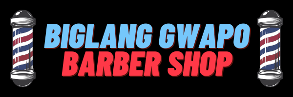

<p align="center">
  
</p>

Welcome to Biglang Gwapo Barber Shop Web Page repository! This webpage is designed to showcase sample images of different haircuts and haircuts of celebrities. It provides a visually appealing interface to help clients choose their desired hairstyles and get inspiration from popular celebrity looks. 

## Table of Contents
- [Features](#features)
- [Frameworks Used](#frameworks-used)
- [Installation](#installation)
- [Usage](#usage)
- [Challenges](#challenges)
- [Contributing](#contributing)
- [License](#license)

## Features

- Display a collection of sample haircut images.
- Show images of popular haircuts worn by celebrities.
- User-friendly interface with smooth navigation.
- Responsive design for seamless viewing on different devices.
- Interactive carousel to showcase multiple images at once.

## Frameworks Used

This web page is built using the following frameworks:

- [React.js](https://reactjs.org/): A JavaScript library for building user interfaces. React.js allows us to create reusable UI components and efficiently manage state changes.
- [Tailwind CSS](https://tailwindcss.com/): A utility-first CSS framework that provides a set of pre-designed CSS classes to rapidly build custom user interfaces.
- [react-multi-carousel](https://www.npmjs.com/package/react-multi-carousel): A lightweight, customizable carousel component for React.js. It enables us to create responsive carousels with multiple items on each slide.

## Installation

To run this project locally, follow these steps:

1. Navigate to the project directory:
<pre><code>```
<p align="center">
  git clone (<repository_url>)
</p>
```</code></pre>

2. Navigate to the project directory:
<p align="center">
  cd barber-shop-webpage
</p>
```

3. Install the dependencies using a package manager such as npm or yarn:
<p align="center">
  npm install or yarn install
</p>
```


## Usage

Once you have completed the installation steps, you can run the project using the following command:
npm start

This will start the development server and open the web page in your default browser. You can then explore the different haircuts and celebrity images on the webpage.

## Challenges

During the development process, we encountered a few notable challenges:

- **Responsive Design**: Ensuring that the webpage looks and functions well across different devices and screen sizes required careful consideration and testing.
- **Integration of React.js and Tailwind CSS**: Integrating these two frameworks seamlessly and leveraging their respective features and best practices was a learning experience for our team.
- **Customizing the Carousel Component**: Configuring and customizing the react-multi-carousel component to suit our specific needs took some experimentation and fine-tuning.

## Contributing

We welcome contributions to enhance the features or fix any issues of this web page. If you'd like to contribute, please follow these steps:

1. Fork the repository.
2. Create a new branch for your feature or bug fix.
3. Make your changes and commit them with descriptive commit messages.
4. Push your changes to your forked repository.
5. Open a pull request, describing your changes in detail and mentioning any relevant issues.

## License

This project is licensed under the [MIT License](LICENSE). Feel free to use and modify the code as per your requirements.


